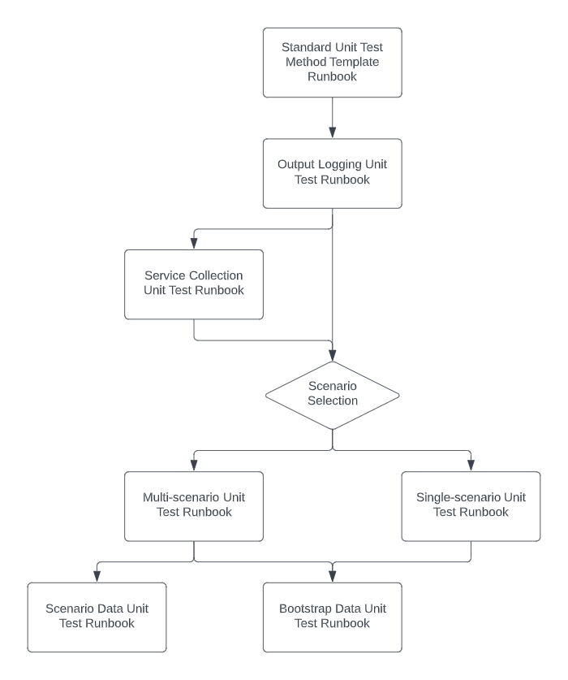

# Unit Testing Playbook

In this playbook we provide guidance that helps you identify the runbook to suit the type of unit test you are about the write. The runbooks we provide will guide teams and individuals through setting up unit tests.

Target Audience
- Testers
- Test leads
- Developers
- Team leads
- Architects
- Analysts

Use the Unit Testing Decision Tree to create a mental model for good unit tests practices.

There are two basic runbooks that should be employed at all times:
- Standard Unit Test Method Template Runbook
- Output Logging Unit Test Runbook

Working down from the top...

If you need to provide services to your unit test that are best set up through dependency injection or mocks, then add the Service Collection Unit Test Runbook.

You now need to choose between Multi- or Single-scenario Unit Tests Runbooks.

Lastly you should determine if you need to:
1. load test data for each test using the Scenario Data Unit Test Runbook?
1. bootstrap a data store prior to running the test using the Bootstrap Data Unit Test Runbook?

## Runbooks

- [Standard Unit Test Method Template Runbook](Runbooks/001-StdUnitTestMethodTemplate.md)
- [Output Logging Unit Test Runbook](Runbooks/002-OutputLoggingUnitTests.md)
- [Scenario Data From Json Unit Test Runbook](Runbooks/003-ScenarioDataFromJsonUnitTests.md)
- [Single-scenario Data Unit Test Runbook](Runbooks/004-SingleScenarioDataUnitTests.md)
- [Multi-scenario Data Unit Test Runbook](Runbooks/005-MultiScenarioDataUnitTests.md)
- [Scenario Data From CSV Unit Test Runbook](Runbooks/006-ScenarioDataFromCSVUnitTests.md)
- [Service Collection Unit Test Runbook](Runbooks/007-ServiceCollectionUnitTests.md)
- [Bootstrap Data Unit Test Runbook](Runbooks/008-BootstrapDataUnitTests.md)

Providing a structured approach to testing is one of the most valuable aspects to any software development team and their projects.

The goal of this library is to provide a starting point for individuals and teams to get their tests consistently setup, written, maintained, and reviewed.

## Library Structure

See this [Test Library Structure](TestLibraryStructure.md) document for more details on all the types provided in this library.